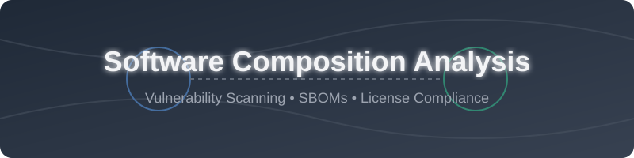

<!-- SEO: Software Composition Analysis, SCA, Open Source Security, SBOM, Vulnerability Scanning, DevSecOps, AppSec, Supply Chain Security -->

  

  
  
  
  

# 🛡️ Awesome Software Composition Analysis (SCA)

> A curated list of **SaaS Platforms** and **Open-Source GitHub Projects** focused on Dependency Vulnerability Scanning, License Compliance, SBOM Generation & Supply-Chain Risk.

**Last updated: August 2026**

This repository tracks notable **SaaS platforms** ☁️ and **open-source projects** 💻 for **Software Composition Analysis (SCA)**. These tools identify known vulnerabilities, malicious packages, and license risks in open-source and third-party dependencies, generate Software Bills of Materials (SBOMs), enforce policies, and help remediate issues across the software development lifecycle. 🚀

**Open-source emphasis**: This section is heavily expanded with every major active project for self-hosting, SBOM generation, vulnerability matching, continuous monitoring, and open dependency scanning — ideal for security teams, DevSecOps engineers, and organizations building transparent, vendor-independent SCA capabilities. 🔐

Contributions welcome! Open a PR to add/update entries. Keep descriptions factual and link to official sites. ✨

## 📑 Table of Contents
- [☁️ SaaS/Hosted Platforms](#️-saashosted-platforms)
- [💻 Open-Source GitHub Projects](#-open-source-github-projects)
- [📈 Additional Strong Open-Source Options](#-additional-strong-open-source-options)
- [🤝 How to Contribute](#-how-to-contribute)
- [⚠️ Disclaimer](#️-disclaimer)
- [⭐ Star History](#-star-history)

---

## ☁️ SaaS/Hosted Platforms

| Product | Description | Pricing | Free Tier Limit | Company Size |
|---------|-------------|---------|-----------------|--------------|
| **[Google OSV-Scanner](https://google.github.io/osv-scanner/)** | Official scanner for the OSV vulnerability database, offering accurate lockfile-driven scanning. | Free | Unlimited | ~$2 Trillion (Google) |
| **[Deps.dev](https://deps.dev/)** | Google-backed public service providing dependency insights and supply-chain metadata. | Free | Unlimited | ~$2 Trillion (Google) |
| **[Snyk](https://snyk.io/)** | Developer-first SCA platform with IDE and PR integrations, reachability analysis, auto-fix PRs. | Freemium | 200 tests/month for private repos | ~$7.4B Valuation |
| **[JFrog Xray](https://jfrog.com/xray/)** | Universal SCA deeply integrated with Artifactory for scanning binaries, packages, and containers. | Paid | N/A | ~$6B Market Cap |
| **[Checkmarx SCA](https://checkmarx.com/)** | Part of the Checkmarx AppSec platform, delivering SCA alongside SAST with reachability features. | Paid | N/A | ~$1.15B Valuation |
| **[Mend.io](https://www.mend.io/)** | Enterprise SCA offering vulnerability detection, license compliance, and policy enforcement. | Paid | Free for open-source only | ~$1B+ Valuation |
| **[Sonatype Lifecycle](https://www.sonatype.com/products/lifecycle)** | Component intelligence and policy engine blocking risky open-source components at build stages. | Paid | N/A | ~$1B+ Valuation |
| **[Black Duck](https://www.blackduck.com/)** | Compliance-focused SCA platform with deep open-source license knowledge base and SBOM features. | Paid | N/A | ~$565M+ Acquired |
| **[Endor Labs](https://www.endorlabs.com/)** | Reachability-focused SCA that uses function-level analysis to dramatically reduce noise. | Paid | N/A | ~$25M Funding |
| **[FOSSA](https://fossa.com/)** | License compliance and SBOM platform specialized in open-source policy enforcement. | Freemium | 5 private projects | ~$23M Funding |
| **[Socket](https://socket.dev/)** | Supply-chain security platform detecting malicious packages through behavioral analysis. | Freemium | Free for open-source | ~$20M Funding |
| **[Anchore](https://anchore.com/)** | Container and SBOM-centric platform providing vulnerability scanning and continuous monitoring. | Paid | N/A | ~$20M Funding |
| **[Phylum](https://www.phylum.io/)** | Software supply-chain risk platform specializing in malicious package detection. | Freemium | Community Edition available | ~$15M Funding |
| **[Debricked](https://debricked.com/)** | SCA platform focused on dependency risk, license compliance, and remediation guidance. | Freemium | Up to 50 contributors | Acquired by OpenText |

---

## 💻 Open-Source GitHub Projects

| Project | Description | Stars |
|---------|-------------|-------|
| **[Trivy](https://github.com/aquasecurity/trivy)** | Comprehensive all-in-one scanner for dependencies, containers, filesystems, IaC, secrets, and SBOM. |  |
| **[Renovate](https://github.com/renovatebot/renovate)** | Automated dependency update bot that opens pull requests for outdated or vulnerable packages. |  |
| **[Semgrep](https://github.com/semgrep/semgrep)** | Lightweight static analysis for many languages, including reachability-aware dependency scanning. |  |
| **[OWASP Dependency-Check](https://github.com/jeremylong/DependencyCheck)** | Classic multi-language SCA tool identifying known vulnerable components using NVD. |  |
| **[Syft](https://github.com/anchore/syft)** | Fast CLI and library for generating CycloneDX and SPDX SBOMs from container images & filesystems. |  |
| **[OSV-Scanner](https://github.com/google/osv-scanner)** | Google-backed open-source scanner querying the OSV database for accurate vulnerability detection. |  |
| **[Dependabot](https://github.com/dependabot/dependabot-core)** | GitHub-native dependency security and version update system supporting automated fix PRs. |  |
| **[Grype](https://github.com/anchore/grype)** | Vulnerability scanner for container images and SBOMs with multi-source CVE matching. |  |
| **[Dependency-Track](https://github.com/DependencyTrack/dependency-track)** | OWASP flagship continuous SBOM monitoring and component analysis platform. |  |
| **[OSS Review Toolkit (ORT)](https://github.com/oss-review-toolkit/ort)** | Suite of tools to assist with managing open source software dependencies and licenses. |  |
| **[GUAC](https://github.com/guacsec/guac)** | Graph for Understanding Artifact Composition - aggregates software supply chain metadata. |  |
| **[cdxgen](https://github.com/CycloneDX/cdxgen)** | Universal CycloneDX SBOM generator supporting 20+ languages and build systems. |  |
| **[OpenSCA](https://github.com/XmirrorSecurity/OpenSCA-cli)** | Open-source SCA engine for detecting third-party component vulnerabilities and license risks. |  |
| **[dep-scan](https://github.com/owasp-dep-scan/dep-scan)** | Security audit tool for project dependencies based on known vulnerabilities and advisories. |  |
| **[bomber](https://github.com/devops-kung-fu/bomber)** | Lightweight tool that scans SBOMs for vulnerabilities using multiple data sources. |  |

---

### 📈 Additional Strong Open-Source Options

- **Ecosystem-native scanners**: npm audit, pip-audit, bundler-audit, cargo-audit, Safety, Retire.js, and similar lockfile tools. 🛡️
- **SBOM tooling**: CycloneDX CLI, SPDX tools, sbom-tool, and format converters. 📦
- **Policy & continuous monitoring**: Dependency-Track policies, OPA/Gatekeeper rules for dependency gates. ⚖️
- **Malicious package detection**: community projects and OSV malicious packages feed integrations. 🦠
- Many language-specific **audit** CLIs and **SBOM** generators maintained by ecosystems. 🌐

**Frameworks for building custom systems**: Combine **Syft + Grype** (or **Trivy**), **OSV-Scanner**, **Dependency-Track** for continuous monitoring, **cdxgen** for SBOMs, and **Renovate/Dependabot** for remediation into a complete open-source SCA pipeline. 🏗️

---

## 🤝 How to Contribute

1. Fork the repo. 🍴
2. Add/edit entries in `README.md` (follow existing format). ✍️
3. Include: name, link, 1–2 sentence description, and whether it's SaaS or open-source. 📝
4. Submit PR with a short explanation. 🚀

Star the repo if you find it useful! ⭐

---

## ⚠️ Disclaimer

- This is a **community-curated** list — not exhaustive and not an endorsement.
- SCA tools must be kept updated with current vulnerability databases and should be combined with reachability, policy, and remediation processes.
- Self-hosted open-source solutions require proper operational security, database freshness, and auditability.

---

## ⭐ Star History

<a href="https://www.star-history.com/?repos=ishandutta2007%2FAwesome-Software-Composition-Analysis&type=date&legend=bottom-right">
<picture>
<source media="(prefers-color-scheme: dark)" srcset="https://api.star-history.com/chart?repos=ishandutta2007/Awesome-Software-Composition-Analysis&type=date&theme=dark&legend=bottom-right" />
<source media="(prefers-color-scheme: light)" srcset="https://api.star-history.com/chart?repos=ishandutta2007/Awesome-Software-Composition-Analysis&type=date&legend=bottom-right" />

</picture>
</a>

**Made for AppSec engineers, DevSecOps teams, platform security, and software supply-chain practitioners.** 👩‍💻👨‍💻  
Let's make software composition analysis more transparent, accurate, and accessible.
